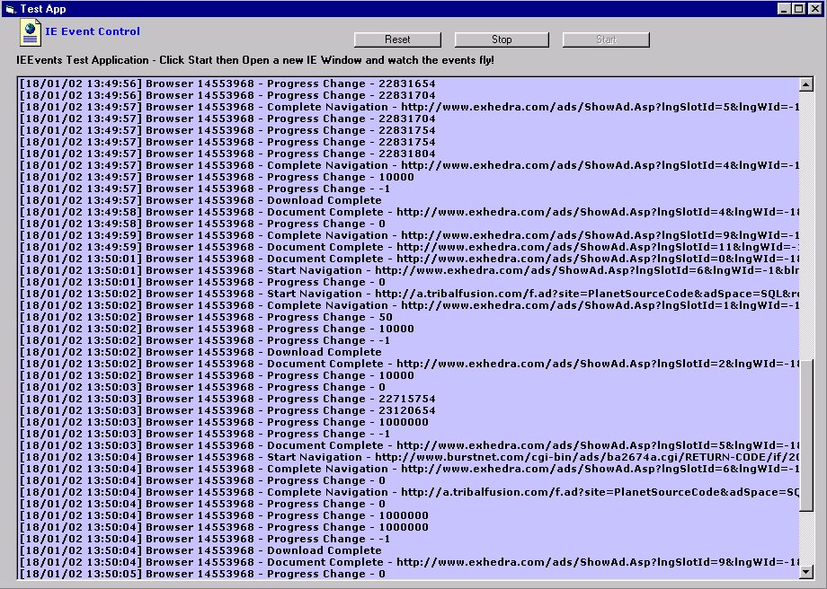



## IE Events

### Description

**UPDATED** Get events from all your IE instances through this one control.... Now has events for new insances started, automatically updates and exposes the browser collection.
 
### More Info
 

             |
---                |---
**Submitted On**   |2002-01-18 14:07:02
**By**             |[Crazyman](https://github.com/Planet-Source-Code/PSCIndex/blob/master/ByAuthor/crazyman.md)
**Level**          |Intermediate
**User Rating**    |5.0 (10 globes from 2 users)
**Compatibility**  |VB 4\.0 \(32\-bit\), VB 5\.0, VB 6\.0
**Category**       |[Custom Controls/ Forms/  Menus](https://github.com/Planet-Source-Code/PSCIndex/blob/master/ByCategory/custom-controls-forms-menus__1-4.md)
**World**          |[Visual Basic](https://github.com/Planet-Source-Code/PSCIndex/blob/master/ByWorld/visual-basic.md)
**Archive File**   |[IE\_Events490421162002\.zip](https://github.com/Planet-Source-Code/crazyman-ie-events__1-30647/archive/master.zip)

